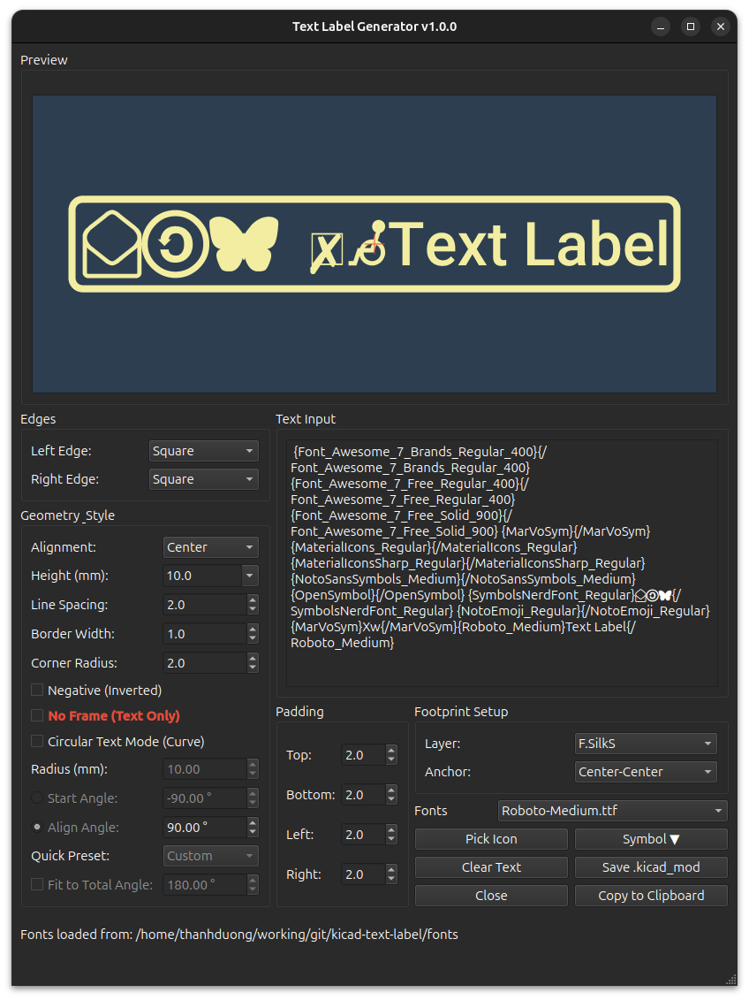
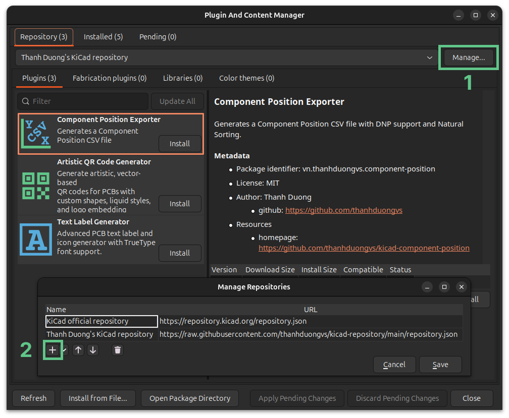

#  Text Label Generator

A powerful **KiCad 9.0+** plugin for generating high-quality, vector-based text labels and symbols directly on your PCB. 

This tool allows you to use TrueType fonts, create inverted (negative) text, apply custom border styles, and mix multiple fonts in a single label using a rich-text tagging system.

## 🚀 Key Features

* **TrueType/OpenType Support:** Load and render any `.ttf` or `.otf` font.
* **Rich Text Tagging:** Mix different fonts in one string (e.g., `{Roboto}Text {FontAwesome}Icon{/FontAwesome}{/Roboto}`).
* **Negative Rendering:** Easily create "inverted" text (text cut out from a solid block) for silkscreen or copper layers.
* **Advanced Geometry Processing:** * Robust boolean operations for complex fonts (like Roboto) to prevent self-intersection artifacts.
    * Optimized path stitching for symbol fonts.
* **Custom Borders & Caps:**
    * Styles: Square, Round, Triangle, Pointed, Ribbon (In/Out), Trapezoid.
    * Adjustable border width and corner radius.
* **Symbol Picker:** Built-in visual dialog to browse and select icons from loaded symbol fonts.
* **Live Preview:** Real-time WYSIWYG preview with auto-zoom and pan.
* **Export Options:**
    * **Copy to Clipboard:** Paste directly into Pcbnew.
    * **Save as File:** Save as a `.kicad_mod` footprint file.

## 🛠️ Installation

### Via KiCad Plugin and Content Manager (Recommended)
Add our custom repo to **the Plugin and Content Manager**, the URL is:
`https://raw.githubusercontent.com/thanhduongvs/kicad-repository/main/repository.json`

### Manual Installation
- Download the plugin source code as **a .zip** file.
- Locate your KiCad plugins folder:
  - **Windows:** `Documents\KiCad\9.0\plugins`
  - **Linux:** `~/.local/share/kicad/9.0/plugins`
  - **macOS:** `~/Documents/KiCad/9.0/plugins`
- Extract the archive to the KiCad plugins directory
- Restart KiCad / PCB Editor.

## 🖥️ Usage

1.  **Open the Plugin:** Click the "Text Label Generator" icon in the PCB Editor toolbar.
2.  **Select Font:** Choose a text font or a symbol font from the dropdown.
3.  **Input Text:** * Type your text in the input box.
    * Changing fonts automatically inserts tags (e.g., `{Arial}My Text{/Arial}`).
    * Click **"Pick Icon"** to visually select symbols from icon fonts.
4.  **Customize Style:**
    * **Layer:** Select target layer (F.SilkS, F.Cu, F.Mask, etc.).
    * **Geometry:** Adjust Height, Spacing, and Border settings.
    * **Effects:** Check **"Negative"** for inverted text or **"No Frame"** for text only.
5.  **Export:**
    * Click **"Copy to Clipboard"** and press `Ctrl+V` in the PCB Editor.
    * Or click **"Save .kicad_mod"** to save it to your library.

## 📂 Font Management
* Place your text fonts in: `plugin_folder/fonts/texts/`
* Place your symbol/icon fonts in: `plugin_folder/fonts/symbols/`

## 📦 Libraries Used
This project relies on several powerful open-source libraries:
 - [PySide6](https://pypi.org/project/PySide6/): The official Python module from the Qt for Python project, used for the graphical user interface.

## 📜 License and Credits

Plugin code licensed under MIT, see `LICENSE` for more info.